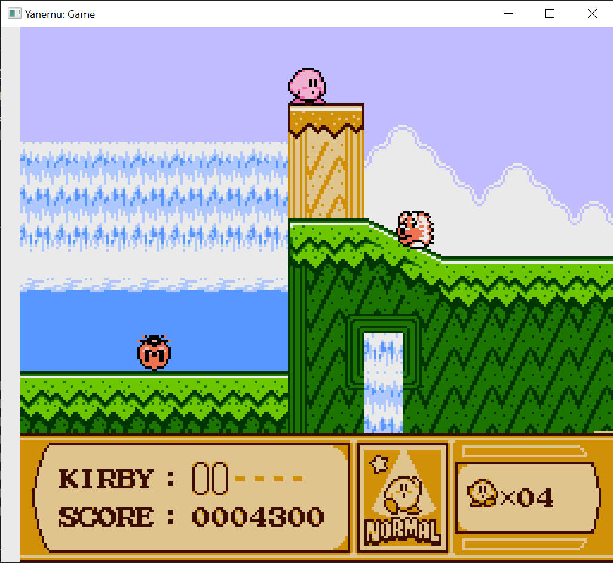
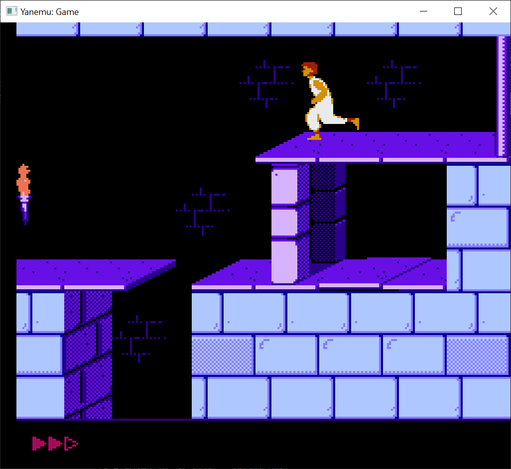
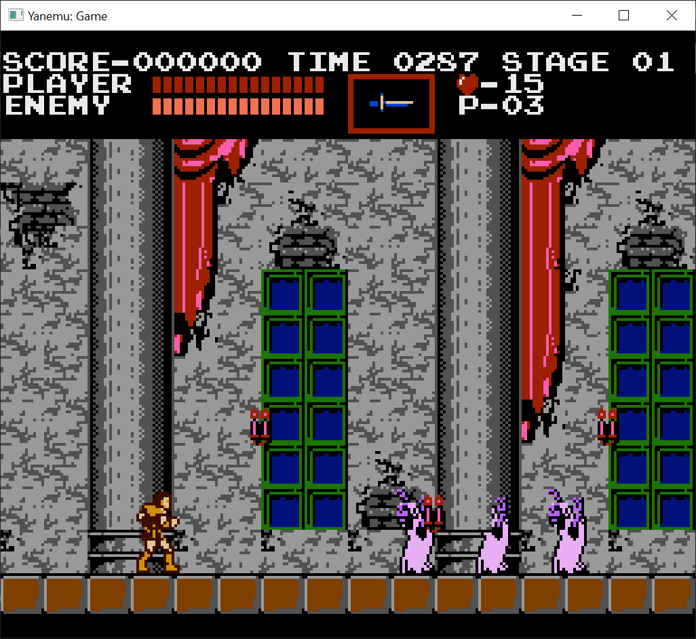
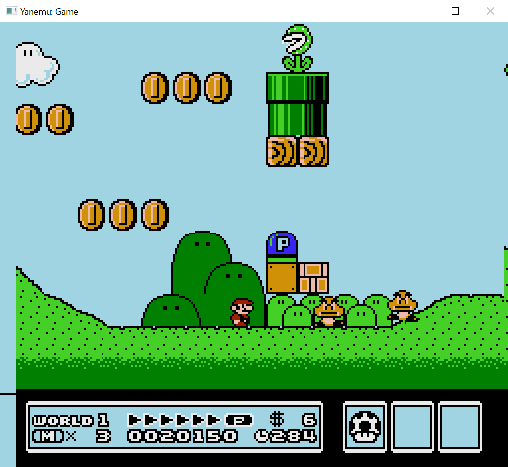

# yanemu or 7ACNE or ACNE7
Yet Another Nes EMUlator..

## What is it ?

This is a NES emulator written in C++, with a pixel-based rendering strategy, coming with support for different [MMCs and Mappers](#mmcs-and-cartridge-support).

## How does it look like?
Here is a demo of the emulator running some games.
| Kirby's Adventure          | Prince Of Persia   |
| ----------------------     | ---------------------- |
|        |  |

| Castlevania                | Super Mario Bros. 3 |
| ----------------------     | ---------------------- |
| |   |

# MMCs and Cartridge support
Currently supports a few [_Mappers_](https://en.wikipedia.org/wiki/Memory_management_controller_(Nintendo)):

 - **[NROM](https://nescartdb.com/search/advanced?ines=0)** (0) : *Donkey Kong*, *(Super) Mario Bros.*, *Ice Climber*...
 - **[SxROM](https://nescartdb.com/search/advanced?ines=1)** (1) (Partial support): *Metroid*, *The Legend of Zelda*, *Tetris*, *Teenage Mutant Ninja Turtles*, *Journey to Silius*... 
 - **[UxROM](https://nescartdb.com/search/advanced?ines=2)** (2): *DuckTales*, *Megaman*, *Castlevania*, *The 3-D Battles of WorldRunner*, *星霊狩り*...
 - **[CNROM](https://nescartdb.com/search/advanced?ines=3)** (3): *Slalom*, *The Legend of Kage*, *Destination Earthstar*...
 - **[TxROM](https://nescartdb.com/search/advanced?ines=4)** (4): *Super Mario Bros.* (2 and 3), *Kirby's Adventure*, *Startropics*, *Gremlins 2*...
 - **[AxROM](https://nescartdb.com/search/advanced?ines=7)** (7): *Battletoads*, *Solstice*...
 - **[Color Dreams](https://nescartdb.com/search/advanced?ines=11)** (11): *Silent Assault*... ~~You shouldn't play these games~~

Works with NTSC ROMs, accurate PAL emulation not stable yet
